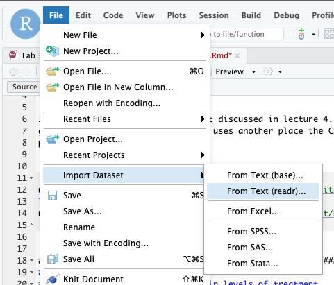

In this homework we will use the NHEFS dataset introduced in week 4.
Take a look at the codebook linked to from
<https://www.hsph.harvard.edu/miguel-hernan/causal-inference-book/>.

Download the dataset and import it into R. Try using the File - Import
Dataset - From text (readr) menu option to do this import yourself.



Here is code to directly import the NHEFS dataset from the web. Note use
of the knitr code chunk option `cache=TRUE` to cache the results locally
and avoid downloading from the web each time you run your program.

```{r, cache=TRUE}
library(readr)
nhefs <- read_csv("https://cdn1.sph.harvard.edu/wp-content/uploads/sites/1268/1268/20/nhefs.csv")
```

# Question 1: customizing `read_csv`

Using help from the Import Dataset tool demonstrated above, change the
above `read_csv` command to import any factor (categorical) variables in
the first 15 columns as factors instead of double (numeric). You don't
need to recode their numeric values yet.

# Question 2: recoding

You will use the following variables. For those that are factors, use
the dplyr `case_match` function to recode them to informative factor
levels. For yes/no factors use "no" as the reference category, and for other 
factors use whichever is the most common group as the reference category.

-   `active`
-   `age`
-   `education`
-   `exercise`
-   `race`
-   `sex`
-   `smokeintensity`
-   `smkyrs`
-   `wt82_71`

# Question 3: Table 1

Use the `table1` package (or an alternative of your choice) to make a
"Table 1" summarizing the above variables. Use the `table1::label`
command to create informative labels for these variables in your table.

# Question 4: draw a DAG

a. Use <http://www.dagitty.net/> to create a DAG for the following
hypothesis. Use the R dagitty package to display this DAG in your
document:

-   `wt82_71` is caused by `qsmk` (in particular, that quitting smoking causes weight gain)
-   `sex`, `race`, `age`, `education`, and `exercise` are hypothesized confounders.

b. Write out in words this research hypothesis, using the meanings of these
variables rather than just their variable names.

c. Also write out in words the null hypothesis for statistical testing. Why 
would you have a two-sided null hypothesis even when in this case the research
hypothesis is one-sided?

# Question 5: fit a regression model

Fit the following multiple linear regression model (note that age
squared is represented in model formula by `I(age^2)`):

$$ 
wt82\_71 \sim qsmk + sex + race + age + age^2 + education + exercise 
$$

See
<https://www.oreilly.com/library/view/the-r-book/9780470510247/ch009-sec009.html>
for a convenient summary of how to use R model formulae.

# Question 6: standardization

a.  Calculate the mean predicted outcomes under treatment (quitting
    smoking) and no treatment (not quitting smoking).
b.  Calculate the difference between these to estimate the causal effect
    of quitting smoking on change in weight.
c.  Is the conditional average treatment effect that you estimated using 
    standardization the same or different than the coefficient for `qsmk` in the 
    table of regression coefficients?

# Question 7: DAG and regression with interactions

Now suppose we hypothesize that smoking intensity also impacts weight loss,
and modifies the effect of quitting smoking on weight loss. 

a.  Draw a new DAG that incorporates these hypothesized effects of smoking intensity.
b.  Fit a new linear regression model that includes a linear and quadratic term 
for `smokeintensity` (as above with age) and an interaction between `qsmk` and
`smokeintensity`.

# Question 8: standardization with interactions

a. Again use standardization to calculate the conditional average treatment effect 
of quitting smoking in this sample.
b. Is this estimate the same or different than the coefficient for `qsmk` in the 
    new table of regression coefficients from Question 7?

# Question 9: bootstrap

a. Write a function that takes two arguments: `function(x, d)` where:
* `x` is a dataframe or tibble of your data
* `d` is an integer vector of row IDs that will be used to choose a subset of 
the dataframe, for example using `dplyr::filter(x, d)`

Using the subset `dplyr::filter(x, d)`, your function should perform the same calculation
as Question 8a, returning the conditional average treatment effect for the same model
with the interaction term.

b. Show the output of calling your function using `d = 1:nrow(x)` to confirm
that this gives the same result as 8a. 

c. Estimate a 95% bootstrap confidence interval for the conditional average
treatment effect, using at least 1000 replications. You are welcome to use your 
favorite method to implement this bootstrap, but I recommend the `boot` library
which is powerful and simpler to use than programming your own simulation.

d. Summarize your findings. Is the effect of quitting smoking on weight change
significant? What is the effect? Is it modified by baseline smoking intensity?

# Question 10: what did those quadratic terms do?

Use the coefficients of `age` and `I(age)^2` to plot the conditional relationship 
between age and weight change for the participants in this study. Specifically,
use the ages of the participants in this study to calculate

$$
y = \beta_{age} * age + \beta_{I(age)^2} * age^2
$$
then create a scatterplot of y vs age. How did the quadratic term change the 
modeled association between age and weight change, compared to a linear term only?
